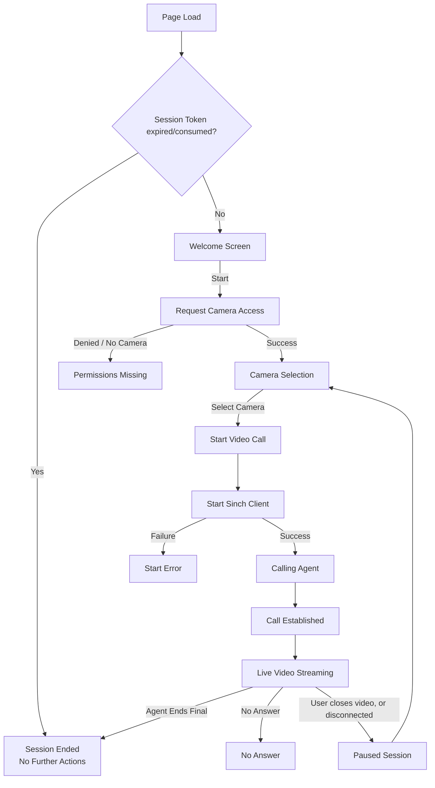

# Sinch Contact Pro Video Assistance
(DRAFT)

Hi there - This document & repository is brand new, and is currently under construction. Please check back soon!

## Feature introduction
Video assistance allows customer to use their mobile device camera to share live video to [Sinch Contact Pro](https://sinch.com/products/contact-pro/) agent. This allows agent to see what the customer sees, enabling agent to provide more accurate and faster customer service.

Note that by *agent* we refer to Contact Pro [Communication Panel](https://docs.cc.sinch.com/cloud/communication-panel/en/index.html) user - Typically someone working in a customer representative role.

## How it works
Video assistance session is established on top of an ongoing traditional phone call. Session is established by agent, by sending an invitation message via SMS. Video Assistance feature has its own UI that appears within the Extension Area of Communication Panel.

In a video assistance session, only the customer is sharing their camera feed, using either back or front camera. Customer can pause the video, and switch between cameras (front/back) if needed. This feature works on all of the most common mobile web browsers, and does not require a separate app to be installed.

If customer switches to any other app or closes browser, video stream is stopped to ensure privacy. In other words, video is sent only while customer actually sees the video assistance UI on screen. If customer accidentally closes their browser, they can re-establish session by re-opening the link as long as the underlying phone call is still ongoing.

When the underlying phone call ends, video assistance session is also ended automatically. Agent can also end video assistance session separately, while still keeping the phone call active. Agent can also send multiple invitations within scope of one phone call, should that be needed.

## Requirements & Configuration
- Feature available starting from Sinch Contact Pro cloud release 26Q2.
- Prerequisites: ***add link to documentation site here***
- Configuration: ***add link to documentation site here***
- Usage: ***add link to documentation site here***

## Reference implementation of the Video Assistance customer-facing UI
This repository contains a bare-minimum reference/example implementation for the customer-facing UI. It is mostly a wrapper for the [Sinch In-App Calling Javascript client](https://developers.sinch.com/docs/in-app-calling/js-cloud), with UI designed for Sinch Contact Pro's video assistance feature.

### Free to use
Organizations using Sinch Contact Pro may freely use and modify the code, and host their own version of the customer-facing UI.

### Localization
Our reference UI is currently available in english only. However, the page is very minimalistic, with not that much text in it. To encourage mobile browsers to suggest translating the page, we include the `lang`-attribute: `<html lang="en">`.

### CDN

Our reference UI is available from our CDN. Should our reference/example UI suffice as-is, Contact Pro customers may freely use it from [https://ext-cc365.cc.sinch.com/video-assistance/en/index.html](https://ext-cc365.cc.sinch.com/video-assistance/en/index.html).

### Operating principle, high-level diagram
