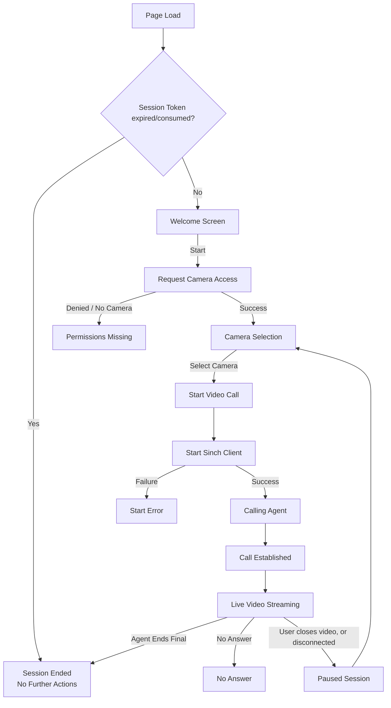

# Sinch Contact Pro Video Assistance

## Feature introduction
With video assistance, the customer can use their mobile device's camera to share live video to a [Sinch Contact Pro](https://sinch.com/products/contact-pro/) agent. This allows the agent to see what the customer sees, enabling faster and more accurate customer service.

Note that by *agent* we mean a Contact Pro [Communication Panel](https://docs.cc.sinch.com/cloud/communication-panel/en/index.html) user - typically someone working in a customer representative role.

## How it works
A video assistance session is established on top of an ongoing traditional phone call. The session is started by the agent, by sending an invitation message via SMS. The video assistance feature has its own UI that appears within the extension area of Communication Panel.

In a video assistance session, only the customer is sharing their camera feed, using either the back or front camera. The customer can stop sharing video and switch between cameras (front/back) if needed. This feature works on all of the most common mobile web browsers, and does not require a separate app to be installed.

If the customer switches to any other app or closes the browser, the video stream is stopped to ensure privacy. In other words, video is sent only while the customer actually sees the video assistance UI on screen. If the customer accidentally closes their browser, they can re-establish the session by re-opening the link as long as the underlying phone call is still ongoing.

When the underlying phone call ends, the video assistance session is ended automatically. The agent can also end the video assistance session separately, while still keeping the phone call active. The agent can send multiple invitations during one phone call, if needed.

## Requirements & Configuration
- Feature available starting from Sinch Contact Pro cloud release 26Q2.
- Configuration: https://docs.cc.sinch.com/cloud/video-assistance/en/configuring_video_assistance.html
- Usage: https://docs.cc.sinch.com/cloud/video-assistance/en/using_video_assistance_dita.html

## Reference implementation of the Video Assistance customer-facing UI
This repository contains a bare-minimum reference/example implementation for the customer-facing UI. It is mostly a wrapper for the [Sinch In-App Calling Javascript client](https://developers.sinch.com/docs/in-app-calling/js-cloud), with a UI designed for Sinch Contact Pro's video assistance feature.

### Free to use
Organizations using Sinch Contact Pro may freely use and modify the code, and host their own version of the customer-facing UI.

### Localization
Our reference UI is currently available in English only. However, the page is very minimalistic, with not that much text on it. To encourage mobile browsers to suggest translating the page, we include the `lang`-attribute: `<html lang="en">`.

### CDN

Our reference UI is available from our CDN. Should our reference/example UI suffice as-is, Contact Pro customers may freely use it from [https://ext-cc365.cc.sinch.com/video-assistance/en/index.html](https://ext-cc365.cc.sinch.com/video-assistance/en/index.html).

### Operating principle, high-level diagram
